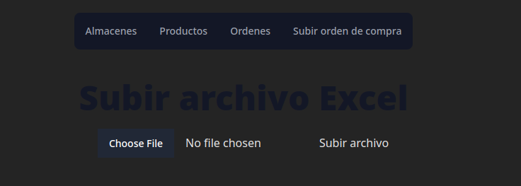

# Prueba Técnica

## API Python

### Instalación

- Crear entorno virtual con los paquetes necesarios ubicados en requirements.py
- Ubicarse en el directorio w2crowd_api
- Levantar el servidor local con `python manage.py run server`

### URLS

- http://127.0.0.1:8000/api/v1/products/ CRUD de productos
- http://127.0.0.1:8000/api/v1/orders_sell/ CRUD de ordenes
- http://127.0.0.1:8000/api/v1/warehouses/ CRUD de almacenes
- http://127.0.0.1:8000/docs/ Documentación de la API

## Frontend Vue

- Ubicarse en el directorio w2crowd-front
- Instalar las dependencias con `npm i`
- Levantar el servidor local con `npm run dev`

Nota: Iniciar subiendo el archivo de orden de compra para poder ver los almacenes, productos y ordenes creados

## Sección en vista de almacenes

## Sección en vista de Productos

## Sección en vista de subir orden de compra

